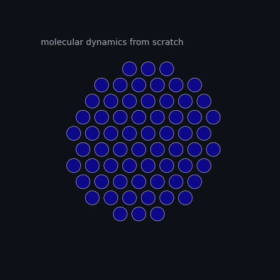
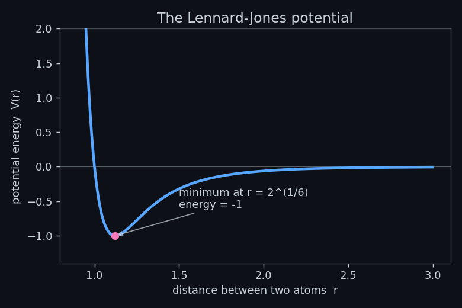
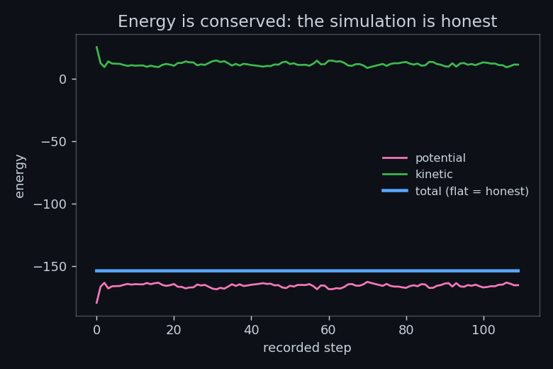

<div align="center">

# atoms-from-scratch

### Learn machine-learning molecular dynamics by building it — from `F = ma` to foundation models. No chemistry PhD required.

[](https://github.com/spacegiyou/atoms-from-scratch/actions/workflows/tests.yml)
[](LICENSE)
[](requirements.txt)
[](notebooks/)



*The nanoGPT of AI-for-Science.*

🎬 **[Watch the 2-minute walkthrough →](https://github.com/spacegiyou/atoms-from-scratch/releases/tag/v0.1.0)** · English narration

⭐ **If this helps you learn, a star makes it easier for the next person to find.**

</div>

---

Every line is plain NumPy or PyTorch you can read in an afternoon. No black-box simulation package, no assumed background — just the physics, built up one runnable notebook at a time, until you're loading a model that already knows almost every material in the periodic table.

Most resources for this field are either API docs for a specific library or fine-tuning recipes written for people who are already computational scientists. This is the on-ramp for everyone else: the curious ML person, the student, the engineer who keeps hearing "AI for materials" and wants to actually understand it.

## The idea in 30 seconds

Molecular dynamics is `F = ma` in a loop. The only hard part is knowing the force.

Classical simulation *hand-writes* the force with a formula — which works for a blob of argon and breaks on real chemistry. Modern AI **learns** it from data. This repo walks the whole arc: you hand-write the force first, then learn it, then stand on the shoulders of a foundation model.

```python
from afs.md import disk_cluster, thermal_velocities, run_md

atoms = disk_cluster(radius=4.0)              # a little blob of atoms
v = thermal_velocities(len(atoms), temp=0.35) # give them some heat
out = run_md(atoms, v, steps=4000)            # F = ma, 4000 times

total = out["total"]
drift = (total.max() - total.min()) / abs(total.mean())
print(f"total energy drifts by only {drift:.2%}")  # ~0: the simulation is honest
```

<div align="center">


</div>

## The curriculum

Eight self-contained notebooks. Each runs on free Colab and ends with one idea that clicks. **All eight are complete.**

| # | Notebook | The "aha" |
|---|----------|-----------|
| **01** | **Molecular dynamics from scratch** | MD is just `F = ma` in a loop |
| **02** | **Why hand-written potentials break** | real chemistry can't be hand-designed |
| **03** | **A neural-network potential from scratch** | energy is a neural net; forces come free from autograd |
| **04** | **Why symmetry *is* the architecture** | the physics symmetries are the inductive bias |
| **05** | **Message passing (graph neural nets)** | modern potentials are geometry-aware GNNs |
| **06** | **Standing on giants: foundation models** | simulate almost any material *zero-shot* |
| **07** | **When your simulation is lying to you** | a run that looks fine can be physical nonsense — here's how to catch it |
| **08** | **Capstone: a real property, end-to-end** | tie it together with uncertainty flags |

> **Notebook 07 is the reason this repo exists.** A learned potential can quietly collapse two atoms into each other because it never saw that configuration, producing a trajectory that looks perfectly normal and is completely wrong. Detecting that — with committee uncertainty and distance-to-training checks — is the difference between a demo and real science, and almost nobody teaches it.

## Run it

```bash
git clone https://github.com/spacegiyou/atoms-from-scratch
cd atoms-from-scratch
pip install -r requirements.txt

jupyter lab notebooks/01_molecular_dynamics_from_scratch.ipynb  # read + run
python assets/make_assets.py                                    # rebuild the GIF
pytest -q                                                       # check the physics
```

Notebooks 03–05 `import` the tested `afs` package, so run them from the repo root (as above). **On Google Colab**, start each notebook with:

```python
!git clone https://github.com/spacegiyou/atoms-from-scratch
%cd atoms-from-scratch
```

Nothing here needs a GPU. The from-scratch notebooks are pure NumPy/PyTorch on a laptop; only notebook 06 touches a pretrained model (`pip install mace-torch ase`), and even that runs on CPU for small systems.

## Why you can trust it

The physics is tested, not just asserted. The suite in [`tests/`](tests/) checks that:

- every potential's **force equals the negative numerical gradient of its energy** — the one check you reuse on every learned potential later, and
- an isolated system integrated with velocity-Verlet **conserves total energy**.

The functions you read in the notebooks are the same ones in [`afs/md.py`](afs/md.py) that these tests verify. Read in the notebook; trust in the module. Every learned potential in the series (notebooks 03, 05, 07) is validated the same way — its autograd forces are checked against finite differences, and its MD is checked for energy conservation.

## Why this exists

I build machine-learning potentials for a living, in batteries and materials, and I kept watching smart people bounce off this field — not because the ideas are hard, but because every on-ramp assumes you already speak the language. The core is genuinely simple: energy, its gradient, a loop. So I wrote the introduction I wish I'd had, from `F = ma` up, with the failure modes included instead of hidden.

## License

MIT — see [LICENSE](LICENSE). Use it, teach with it, fork it.
